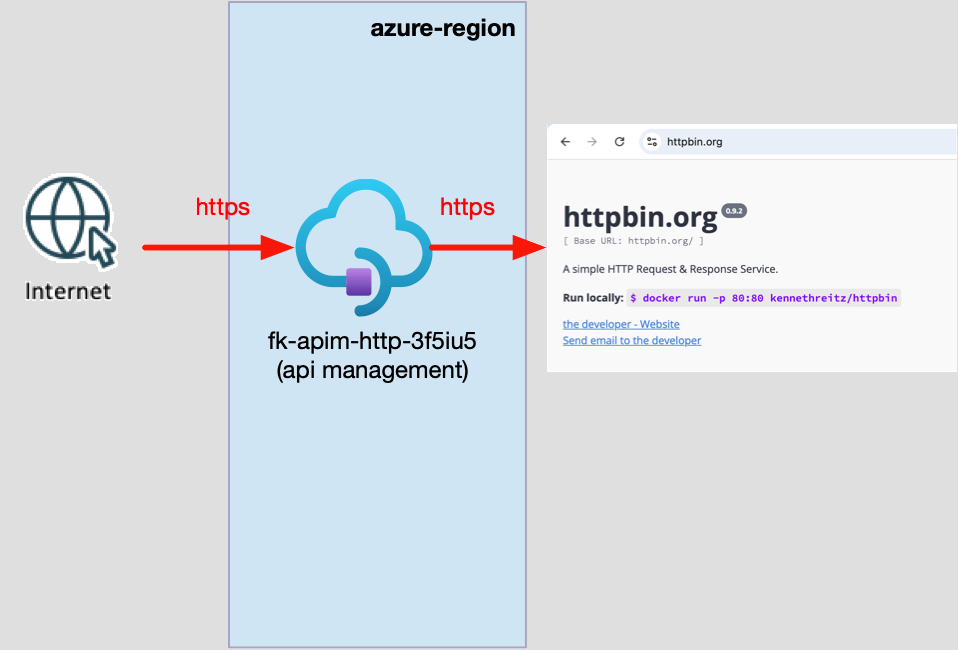
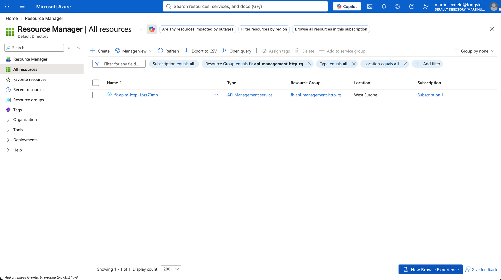
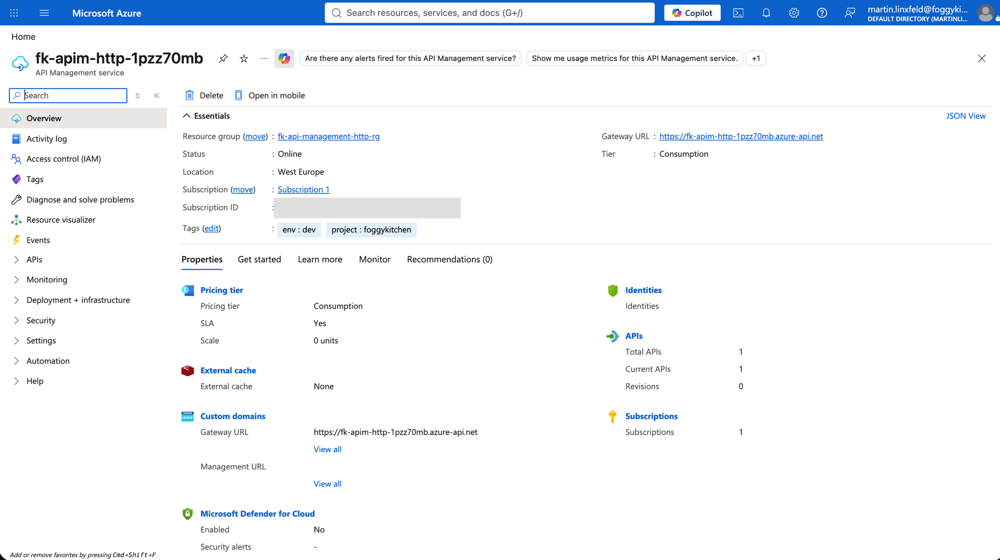
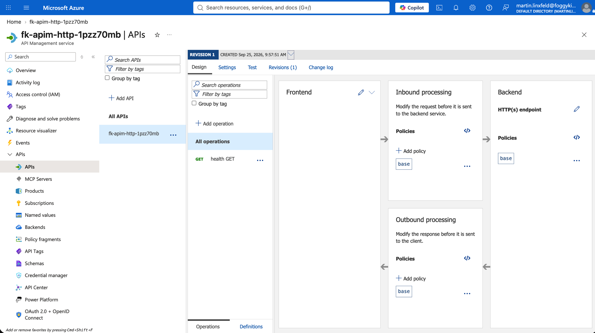
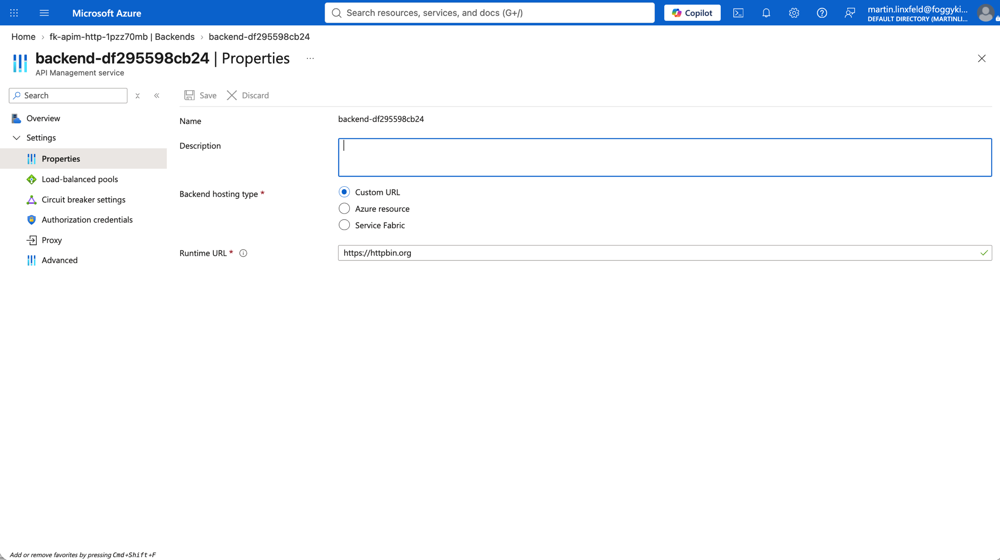
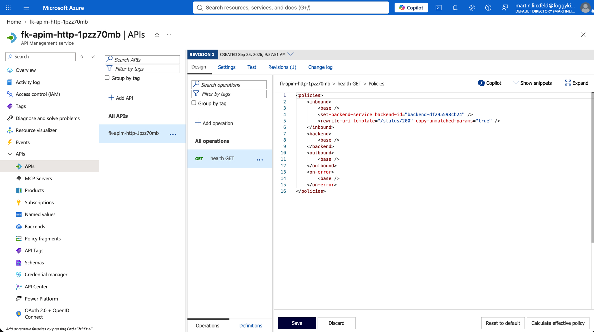

# Example 01: Public HTTP Backend

In this Azure API Management example, we deploy a **Consumption-tier API Management service** using **Terraform/OpenTofu** and route one public operation to an existing HTTPS backend.
The API exposes `GET /v1/health` and forwards the request to `https://httpbin.org/status/200`.

This example focuses on the smallest complete API-fronting path: a public serverless gateway, one API, one operation, one backend, and an internally generated operation policy.

It is the direct Azure counterpart to the OCI API Gateway `01_public_http_backend` example.

---

## Architecture Overview



*Figure 1. A public API Management Consumption gateway exposes `GET /v1/health` and routes the request over HTTPS to `https://httpbin.org/status/200`.*

This deployment creates:

- A dedicated **Azure Resource Group**
- One public **API Management** service using the Consumption tier
- One API with the path prefix `/v1`
- One `GET /health` API operation
- One APIM backend targeting `https://httpbin.org`
- One generated operation policy that selects the backend and rewrites the URI to `/status/200`

The example does not create or own the external HTTP service. It also does not create VNets, subnets, identity/RBAC assignments, products, subscriptions, Application Gateway, Front Door, or Load Balancers.

---

## Access Layout

- **API Management tier:** Consumption (`Consumption_0`)
- **Gateway reachability:** public only
- **Protocol:** HTTPS
- **API path prefix:** `/v1`
- **Operation:** `GET /health`
- **Public route:** `/v1/health`
- **Backend:** `https://httpbin.org/status/200`
- **APIM subscription required:** no
- **Backend authentication:** none

The API is intentionally anonymous to match the minimal OCI example. Set `subscription_required = true` when the composition should require APIM subscription keys.

Consumption-tier APIM supports neither inbound Private Endpoints nor VNet injection/integration. A different tier and networking composition are required for private clients or private backends.

---

## Deployment Steps

Copy the example variables file:

```bash
cp terraform.tfvars.example terraform.tfvars
```

The file contains only the Resource Group name, Azure region, publisher metadata, and tags. It contains no password, token, subscription key, Function key, or other secret.

Initialize and apply the Terraform/OpenTofu configuration:

```bash
tofu init
tofu plan
tofu apply
```

After a successful deployment, OpenTofu outputs the API Management service ID, public gateway URL, and resolved route endpoint.

API Management provisioning can take tens of minutes even for the Consumption tier. This is normal service behavior and should be allowed for in automation timeouts.

---

## Runtime Notes

Retrieve and call the route:

```bash
tofu output route_endpoints
curl -i "$(tofu output -json route_endpoints | jq -r '.health')"
```

The expected backend result is an HTTP `200` response with an empty body.

The public `routes` input contains only the typed backend URL. Internally, the module creates an `azurerm_api_management_backend` and renders an `azurerm_api_management_api_operation_policy` containing:

```xml
<set-backend-service backend-id="..." />
<rewrite-uri template="/status/200" copy-unmatched-params="true" />
```

No policy XML is supplied by the module consumer.

The example was deployed against Azure on 2026-09-25. OpenTofu created all seven planned resources successfully. The APIM route and the backend URL both returned HTTP `503` during the runtime check because `https://httpbin.org/status/200` itself was temporarily unavailable. This confirms matching upstream failure propagation, but it is not recorded as a successful HTTP `200` backend test.

---

## Azure Console And Runtime Verification

The screenshots below show the deployed resources on 2026-09-25.

### Resource Group

The filtered Resource Manager view contains the single API Management service created in the dedicated `fk-api-management-http-rg` Resource Group.



*Figure 2. The dedicated Resource Group contains the Consumption-tier API Management service created by the example.*

### API Management Overview

The service reports status `Online`, runs in West Europe on the Consumption tier with zero fixed units, and exposes its Azure-managed public gateway hostname. The overview also confirms one current API and the example tags.



*Figure 3. API Management overview showing the online Consumption service, public gateway URL, zero fixed scale units, one API, and the expected tags.*

### API And Operation

The API design view contains one current revision and the `health GET` operation. The module combines the API path `/v1` with the operation template `/health` to expose `/v1/health`.



*Figure 4. The deployed API and its single `health GET` operation, with the policy pipeline visible in the design view.*

### Backend

The generated backend uses the `Custom URL` hosting type and `https://httpbin.org` as its runtime base URL. The target path remains operation-specific and is applied through the generated rewrite policy.



*Figure 5. Generated APIM backend `backend-df295598cb24` using `https://httpbin.org` as its runtime URL.*

### Operation Policy

The operation-level XML selects the generated backend with `<set-backend-service>` and translates the public `/health` operation into the backend path `/status/200` with `<rewrite-uri>`.



*Figure 6. Internally generated policy for `health GET`, showing backend selection and the `/status/200` URI rewrite.*

### Runtime Test

The deployed route was called after provisioning. Both the APIM endpoint and a direct request to `https://httpbin.org/status/200` returned the same temporary HTTP `503` response from the external service. Repeat the smoke test when httpbin is healthy to confirm the expected empty HTTP `200` response.

If `subscription_required` is changed to `true`, also create and associate the required APIM product/subscription outside this module and supply its key when testing.

---

## Cleanup

```bash
tofu destroy
```

---

## Summary

This example demonstrates:

- A minimal public Consumption-tier API Management service
- One HTTPS operation backed by an existing public HTTP endpoint
- Anonymous API access matching the OCI minimal example
- Typed backend configuration without consumer-authored policy XML
- Internally generated backend-selection and URI-rewrite policy
- Secret-free example variables
- Separation of API gateway infrastructure from backends, networking, identity, and edge services

---

## Learn More

Visit [FoggyKitchen.com](https://foggykitchen.com/) for Azure, OCI, multicloud, and Terraform/OpenTofu learning resources.

---

## License

Licensed under the **Universal Permissive License (UPL), Version 1.0**.
See [LICENSE](../../LICENSE) for more details.

---

© 2026 [FoggyKitchen.com](https://foggykitchen.com) - Cloud. Code. Clarity.
