# Example 02: Functions Backend

In this Azure API Management example, we deploy one **Python Function App** and publish two HTTP-triggered functions through a public **Consumption-tier API Management** gateway.
The example composes `terraform-az-fk-function` from GitHub with the local API Management module.

The gateway exposes `POST /v1/fncustom1` and `POST /v1/fncustom2`. Each operation is connected to its Function backend through policy XML generated internally by the API Management module.

This is the direct Azure counterpart to the OCI API Gateway `02_functions_backend` example.

---

## Architecture Overview

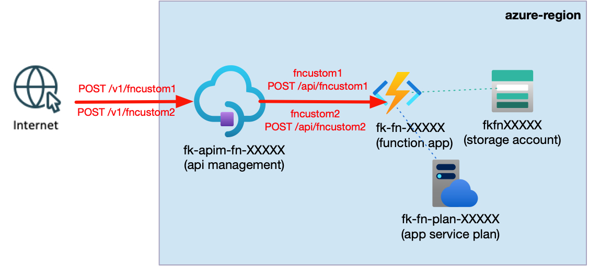

*Figure 1. A public API Management Consumption gateway exposes two POST routes and forwards them to `fncustom1` and `fncustom2` in one shared Linux Function App backed by a Consumption Service Plan and host Storage Account.*

This deployment creates:

- A dedicated **Azure Resource Group**
- One **Storage Account** required by the Azure Functions host
- One Linux **Consumption Service Plan** through `terraform-az-fk-function`
- One Linux **Function App** through `terraform-az-fk-function`
- One ZIP package containing two Python v2 programming-model HTTP triggers
- One public **API Management** service using the Consumption tier
- One API with the path prefix `/v1`
- Two POST operations: `fncustom1` and `fncustom2`
- One APIM backend per Function route
- One generated APIM operation policy per operation

The two Functions share one Function App, Service Plan, runtime package, and host Storage Account. They are discovered by the Azure Functions host from the deployed Python package; they are not separate Terraform-managed resources.

The example does not create VNets, subnets, Private Endpoints, managed identities, RBAC assignments, Function keys, APIM products/subscriptions, Application Gateway, Front Door, or Load Balancers.

---

## Service And Route Layout

- **API Management tier:** Consumption (`Consumption_0`)
- **Gateway reachability:** public only
- **Function hosting plan:** Linux Consumption (`Y1`)
- **Function runtime:** Python `3.12`
- **Functions host:** `~4`
- **ZIP-deployed functions:** `fncustom1`, `fncustom2`
- **APIM routes:** `POST /v1/fncustom1`, `POST /v1/fncustom2`
- **Function routes:** `POST /api/fncustom1`, `POST /api/fncustom2`
- **Function authorization:** anonymous
- **APIM subscription required:** no

The Python functions use explicit `@app.function_name(...)` decorators, making the resource names used in the constructed Function IDs deterministic:

```hcl
"${module.function.id}/functions/fncustom1"
"${module.function.id}/functions/fncustom2"
```

The Function module creates the Function App and deploys the ZIP. Azure discovers the two functions when the host indexes `function_app.py` after deployment.

---

## Deployment Steps

Copy the example variables file:

```bash
cp terraform.tfvars.example terraform.tfvars
```

The file contains only the Resource Group name, Azure region, publisher metadata, and tags. It contains no password, Function key, APIM subscription key, connection string, or other secret.

Initialize and apply the Terraform/OpenTofu configuration:

```bash
tofu init
tofu plan
tofu apply
```

Initialization downloads `terraform-az-fk-function` from its GitHub repository and installs the AzureRM, Random, and Archive providers. The Archive provider builds `function.zip` locally from the example's `function/` directory.

After a successful deployment, OpenTofu outputs the API Management service ID, Function App ID, and resolved public endpoints for both routes.

API Management provisioning can take tens of minutes. Function discovery can also require a short settling period immediately after ZIP deployment.

---

## Runtime Notes

Retrieve the route endpoints:

```bash
tofu output route_endpoints
```

Call both functions through API Management:

```bash
FNCUSTOM1_URL="$(tofu output -json route_endpoints | jq -r '.fncustom1')"
FNCUSTOM2_URL="$(tofu output -json route_endpoints | jq -r '.fncustom2')"

curl -i -X POST "$FNCUSTOM1_URL"
curl -i -X POST "$FNCUSTOM2_URL"
```

Expected response bodies:

```text
fncustom1
fncustom2
```

The deployment was verified in Azure on **25 September 2026**. Both direct Function App endpoints and both API Management routes returned HTTP 200 with the expected function-specific body:

| Request | Status | Response body |
|---|---:|---|
| `POST /api/fncustom1` (Function App) | `200 OK` | `fncustom1` |
| `POST /api/fncustom2` (Function App) | `200 OK` | `fncustom2` |
| `POST /v1/fncustom1` (API Management) | `200 OK` | `fncustom1` |
| `POST /v1/fncustom2` (API Management) | `200 OK` | `fncustom2` |

The Functions use anonymous authorization so this secret-free example requires no Function key. For a Function using `FUNCTION` authorization, pass the API Management module a sensitive `function_keys` map keyed by route name:

```hcl
function_keys = {
  fncustom1 = var.fncustom1_key
}
```

The module stores the value in a secret APIM named value and configures the backend credential to send `x-functions-key`. Never commit a real key or place it in `terraform.tfvars.example`.

For every operation, the module internally renders policy equivalent to:

```xml
<set-backend-service backend-id="..." />
<rewrite-uri template="/api/fncustom1" copy-unmatched-params="true" />
```

The second operation uses `/api/fncustom2`. Module consumers never write or pass policy XML.

---

## Azure Console And Runtime Verification

The following Azure Portal views document the deployed example.

### Resource Group

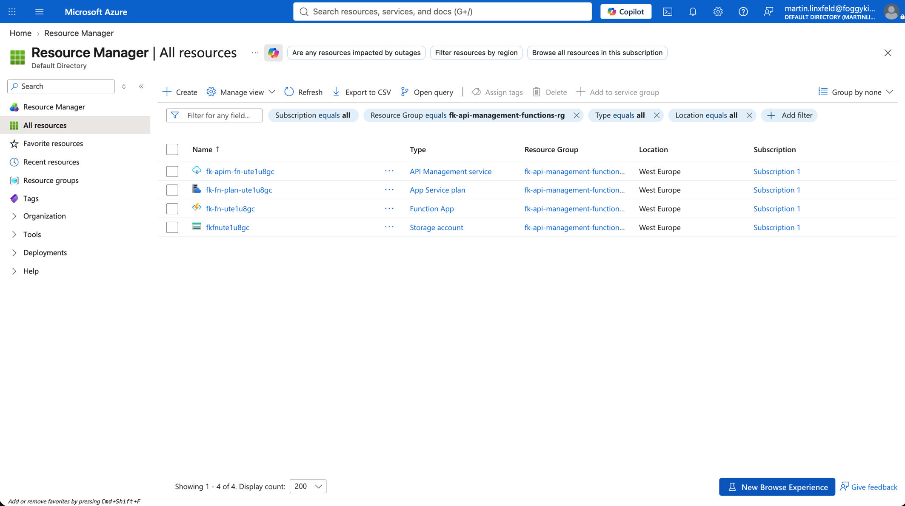

*Figure 2. The example Resource Group contains API Management, the Function App, its Consumption Service Plan, Storage Account, and Application Insights resources created by the composed modules.*

### API Management Overview

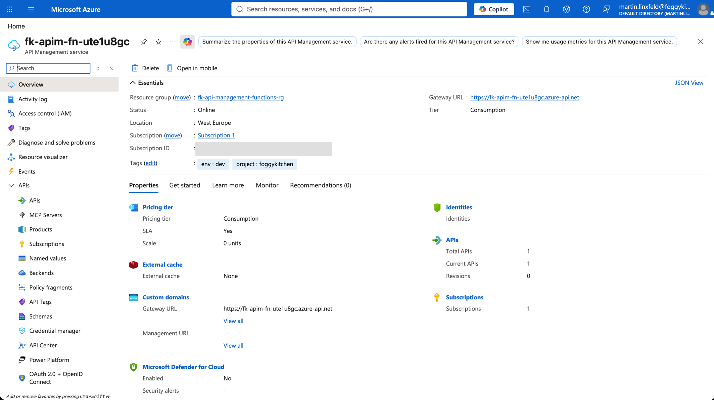

*Figure 3. The API Management overview shows the deployed public gateway using the Consumption tier.*

### API Operations

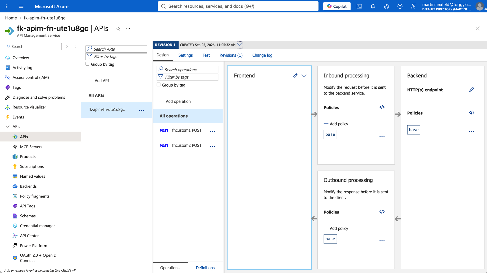

*Figure 4. The API uses the `/v1` suffix and exposes the `fncustom1` and `fncustom2` POST operations.*

The deployed operations are:

- `fncustom1 POST` with URL template `/fncustom1`
- `fncustom2 POST` with URL template `/fncustom2`

### APIM Backends And Policies

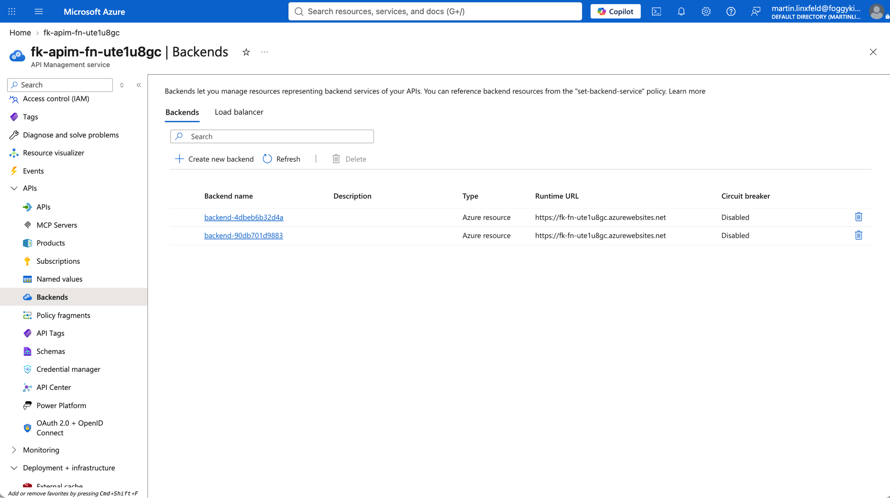

*Figure 5. API Management contains one internally generated backend for each Function route.*

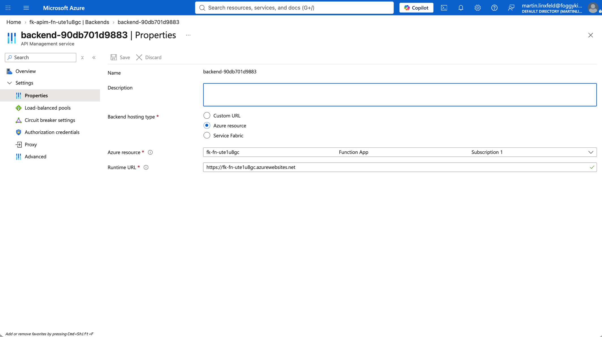

*Figure 6. The `fncustom1` backend targets the Function App and carries the Azure Function resource identifier used by API Management.*

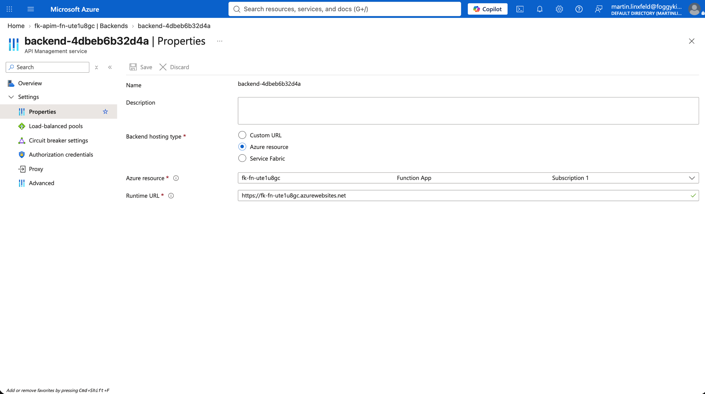

*Figure 7. The `fncustom2` backend targets the same Function App with its route-specific Function resource identifier.*

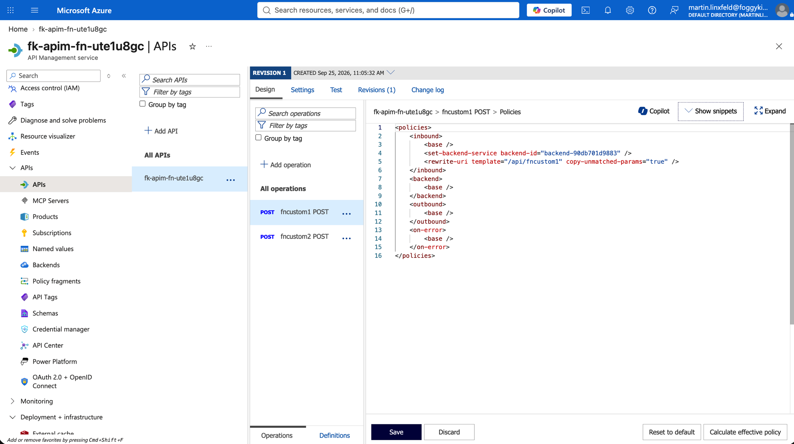

*Figure 8. The generated `fncustom1` operation policy selects its backend and rewrites the request URI to `/api/fncustom1`.*

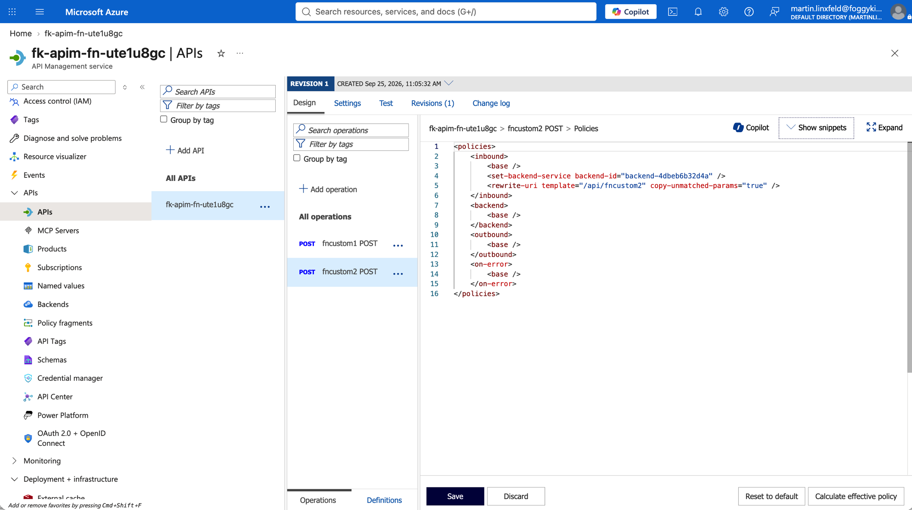

*Figure 9. The generated `fncustom2` operation policy selects its backend and rewrites the request URI to `/api/fncustom2`.*

### Function App And Function Discovery

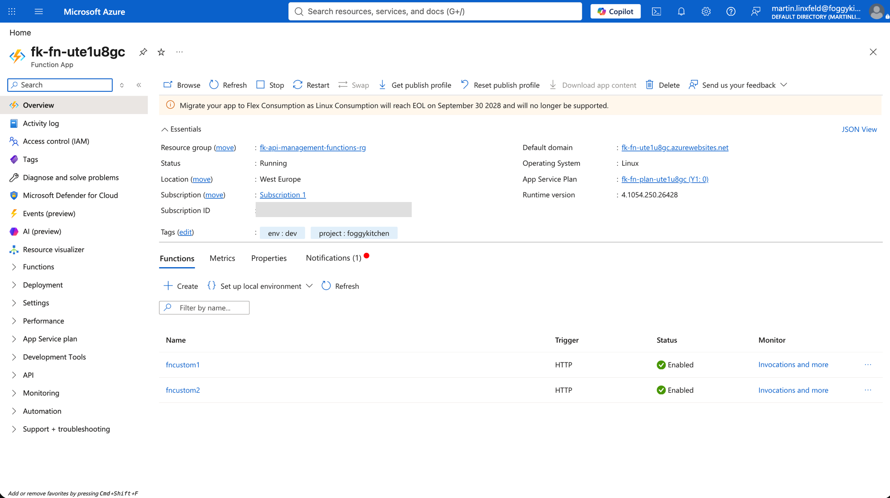

*Figure 10. The Linux Function App overview shows both functions discovered from the deployed Python ZIP package.*

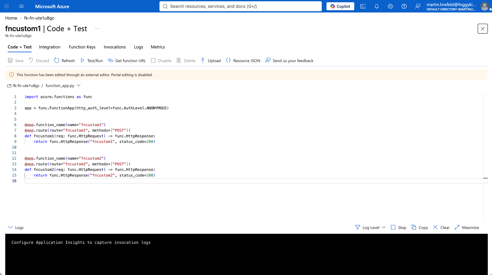

*Figure 11. The deployed Python v2 application explicitly declares the `fncustom1` and `fncustom2` HTTP-triggered functions.*

### Consumption Service Plan

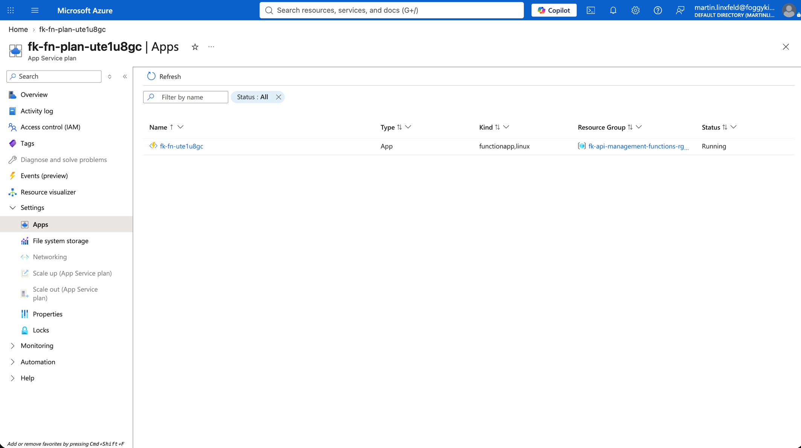

*Figure 12. The Function App runs on the Linux Consumption Service Plan created by `terraform-az-fk-function`.*

### Host Storage

Confirm that the Function App references the example's Storage Account. The Python handlers do not access blobs, but Azure Functions requires this account for host state, trigger coordination, scaling metadata, and runtime operations.

### Runtime Test

The four successful direct and gateway test results are recorded in the [Runtime Notes](#runtime-notes) table above. Runtime results are kept as text so they remain searchable, accessible, and directly reviewable rather than being embedded in a screenshot.

---

## Cleanup

```bash
tofu destroy
```

The generated `function.zip` is a local build artifact and is ignored by Git.

---

## Summary

This example demonstrates:

- Composition with `terraform-az-fk-function`
- One Linux Consumption Function App containing two explicitly named functions
- ZIP packaging and Python v2 function discovery
- Two public APIM operations routed to distinct Function targets
- Typed `FUNCTION_BACKEND` inputs without consumer-authored policy XML
- Optional Function-key forwarding through secret APIM named values
- Secret-free example variables
- Separation of API gateway, Function runtime, networking, identity, and client access concerns

---

## Learn More

Visit [FoggyKitchen.com](https://foggykitchen.com/) for Azure, OCI, multicloud, and Terraform/OpenTofu learning resources.

---

## License

Licensed under the **Universal Permissive License (UPL), Version 1.0**.
See [LICENSE](../../LICENSE) for more details.

---

© 2026 [FoggyKitchen.com](https://foggykitchen.com) - Cloud. Code. Clarity.
